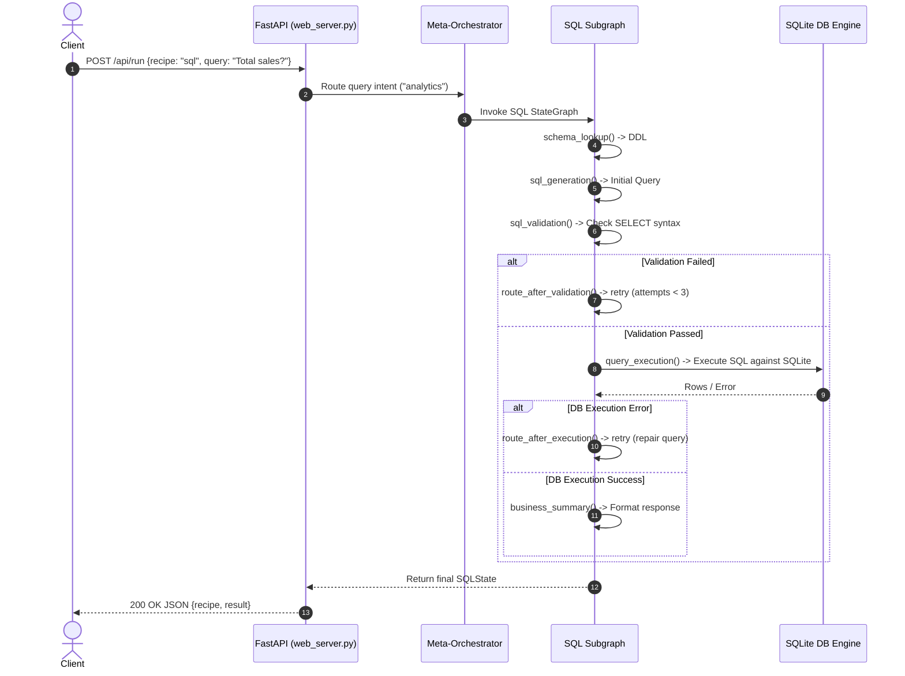

# Technical Architecture & Context Document: PaperForge

**System Name:** PaperForge  
**Reproduction Spec Target:** *Graph-Based Agentic AI with LangGraph* (arXiv:2607.19297)  
**Primary Stack:** Python 3.10+, LangGraph, LangChain Core, SQLite, FastAPI, Pytest  

---

## 1. Executive Summary & Core Value Proposition

### The Problem
Traditional LLM agent workflows rely heavily on implicit state management framed inside system prompts (e.g., *"If the query fails, try again"*). This implicit framing leads to non-deterministic loops, un-auditable decision branches, infinite retry cycles, and lost execution context across long-running enterprise tasks (such as SQL analytics, evidence-gated RAG, and Human-in-the-Loop policy enforcement).

### The Solution
**PaperForge** decouples business logic and process persistence from prompt text by converting workflow pathways into explicit, typed **LangGraph State Graphs** (`StateGraph`). By enforcing explicit state schema (`TypedDict`), deterministic conditional routing functions (`route_after_validation`, `route_after_execution`), and durable checkpointing (`MemorySaver` / `interrupt_before`), state mutations and process interrupts become first-class, auditable system structures rather than prompt-engineering side effects.

```
[ Client Query / API ] 
         │
         ▼
 ┌────────────────────────────────────────────────────────┐
 │           Meta-Orchestrator Intent Router              │
 └───────┬────────────────────────┬───────────────────────┘
         │                        │                      │
         ▼                        ▼                      ▼
┌──────────────────┐    ┌──────────────────┐   ┌──────────────────┐
│   SQL Analytics  │    │   Agentic RAG    │   │   HITL Policy    │
│   (Repair Loop)  │    │ (Evidence Gate)  │   │(Checkpoint Pause)│
└──────────────────┘    └──────────────────┘   └──────────────────┘
```

### Core KPIs/Metrics of Success
1. **Zero-Loop Deadlock Guarantee**: No repair cycle exceeds pre-configured bound `attempts < 3`.
2. **Citation Verification Rate**: 100% of synthesized RAG answers verify evidence presence before returning.
3. **Interrupt Persistence & State Fidelity**: State snapshots preserved accurately across thread pauses (`human_review` step recovery).
4. **Deterministic Testing Coverage**: 100% pass rate on edge-case pytest suites (`test_baseline.py`).

---

## 2. Architectural Blueprint & Component Rationalization

### High-Level End-to-End Request Flow


### Directory Breakdown & Single Responsibility Principle
```text
PaperForge/
├── src/                          # Core Graph Business Logic (Domain Layer)
│   ├── __init__.py               # Python package marker
│   ├── sql_analytics.py          # SQL Repair Loop StateGraph & nodes
│   ├── agentic_rag.py            # RAG Evidence Gating StateGraph & nodes
│   ├── hitl_policy.py           # Checkpoint-backed HITL Policy StateGraph
│   ├── meta_orchestrator.py      # Unified multi-recipe intent router
│   └── web_server.py             # FastAPI REST endpoints & embedded HTML Dashboard
├── tests/                        # Test Automation Layer
│   ├── __init__.py
│   └── test_baseline.py          # Pytest suite for graph state transitions & boundaries
├── scripts/                      # Execution & Benchmarking Utilities
│   ├── __init__.py
│   └── reproduce_minimal.py      # Benchmark runner script for paper reproduction
├── paper/                        # Paper Source Materials
│   └── notes.md                  # Metadata & paper citations (arXiv:2607.19297)
├── AGENTS.md                     # Persistent AI developer rules & contracts
├── PAPER_SPEC.md                 # Formal implementation spec contract
├── REPRODUCTION_NOTES.md         # Audit table of paper ambiguities & decisions
├── VERIFICATION.md               # Requirement verification matrix
├── CLEAN_SETUP_CHECKLIST.md      # Zero-dependency setup guide
├── requirements.txt              # Production Python dependencies
└── README.md                     # GitHub repository overview & usage guide
```

### Design Decisions & Trade-offs

| Decision | Chosen Pattern | Alternative Considered | Rationale & Trade-off |
| :--- | :--- | :--- | :--- |
| **State Orchestration** | **LangGraph StateGraph** | Custom `asyncio` loops / AutoGen | **LangGraph** provides native typed state reducers, explicit routing edges, and built-in thread checkpointing. |
| **Database Engine** | **In-Memory SQLite** (`sqlite3`) | PostgreSQL / DuckDB | Zero external service dependencies for local execution, fast automated testing, and reproducible benchmarks. |
| **State Persistence** | **`MemorySaver` Checkpointer** | Redis / PostgresSaver | In-memory checkpointing allows exact state snapshots and thread resume capabilities without requiring database setup. |
| **State Typing** | `typing.TypedDict` | Pydantic V2 Models | Native compatibility with LangGraph state dictionary merging semantics. |

---

## 3. Deep-Dive Functional Modules

### A. Module 1: SQL Analytics Repair Loop (`src/sql_analytics.py`)
- **Purpose**: Generates SQL from natural language, validates syntax, executes queries against SQLite, and automatically repairs query syntax or schema column errors up to `attempts < 3`.
- **Data Flow & Dependencies**:
  - Inputs: `question: str`, `schema: str`
  - Internal DB: `sqlite3.connect(":memory:")`
  - Output: `final_answer: str`, `rows: List[Any]`
- **Edge Cases & Failure Modes**:
  - *Invalid SQL / Bad Column*: Captured by `query_execution` exception handling; sets `error` field in state and routes to `sql_generation` for repair.
  - *Retries Exhausted (`attempts == 3`)*: Conditional router `route_after_execution` branches to `fail` node, producing a graceful failure response instead of hanging.

```python
def route_after_validation(state: SQLState) -> str:
    if state.get("status") == "validated":
        return "execute"
    if state.get("attempts", 0) < 3:
        return "retry"
    return "fail"
```

### B. Module 2: Agentic RAG Evidence Gating (`src/agentic_rag.py`)
- **Purpose**: Prevents hallucinated RAG responses by filtering retrieved document chunks through an evidence grader node before generation, and verifying citation presence before completion.
- **Data Flow & Dependencies**:
  - Nodes: `retrieve` $\rightarrow$ `grade` $\rightarrow$ `generate` $\rightarrow$ `verify`
  - Routing: Re-retrieves if documents fail relevance grading; re-generates if citations are missing.

### C. Module 3: Human-in-the-Loop Policy Review (`src/hitl_policy.py`)
- **Purpose**: Scores document policy risk. If `risk_score > 0.5`, the state graph triggers `interrupt_before=["human_review"]`, persisting state to `MemorySaver` until an explicit human approval payload is submitted.

### D. Extension Module: Meta-Orchestrator Router (`src/meta_orchestrator.py`)
- **Purpose**: Combines all 3 paper recipes into a single entry point. Classifies query intent (`'analytics'`, `'rag'`, `'policy'`) and dynamically delegates execution to the appropriate subgraph.

---

region Data Layer & State Management
## 4. Data Layer & State Management

### State Schemas (`TypedDict`)

```python
class SQLState(TypedDict):
    question: str
    schema: str
    sql: str
    error: str
    attempts: int
    rows: List[Any]
    final_answer: str
    status: str

class HITLState(TypedDict):
    policy_id: str
    content: str
    risk_score: float
    status: str
    approval_comment: str
```

### State Lifecycle
1. **Initialization**: State instantiated with initial query parameters.
2. **In-Flight Mutations**: Graph nodes return partial dictionaries updating specific keys (e.g., `{"attempts": 2}`).
3. **Checkpoint Interruption**: When hitting `interrupt_before`, LangGraph serializes state into `MemorySaver` keyed by `thread_id`.
4. **State Resume**: Client calls `graph.update_state(config, {"status": "human_approved"})` and resumes graph execution via `graph.invoke(None, config)`.

---

## 5. Developer Implementation Playbook

### Environment Setup
```powershell
# 1. Clone repository
cd c:\Users\KIIT0001\OneDrive\Desktop\GENAI\PaperForge

# 2. Install dependencies
pip install -r requirements.txt

# 3. Run automated tests
python -m pytest tests/test_baseline.py -v

# 4. Launch interactive web dashboard
python -m uvicorn src.web_server:app --port 8000
```

### Critical Conventions
1. **Rule Enforcement**: All changes must adhere to [AGENTS.md](file:///c:/Users/KIIT0001/OneDrive/Desktop/GENAI/PaperForge/AGENTS.md).
2. **Paper Citations**: Docstrings must reference corresponding section/listing numbers from arXiv:2607.19297.
3. **Pytest Gate**: Run `python -m pytest tests/test_baseline.py` after any code modification.

### First Implementation Milestones Checklist
- [x] Step 1: Initialize project workspace & paper metadata.
- [x] Step 2: Generate baseline graph scaffolding using `paper2code`.
- [x] Step 3: Establish `PAPER_SPEC.md` and `AGENTS.md` contracts.
- [x] Step 4: Run end-to-end smoke test suite.
- [x] Step 5: Build `VERIFICATION.md` requirement matrix.
- [x] Step 6: Perform controlled refactoring & implement meta-orchestrator extension.
- [x] Step 7: Build minimal reproduction benchmark script (`scripts/reproduce_minimal.py`).
- [x] Step 8: Build interactive Web Dashboard (`src/web_server.py`).
